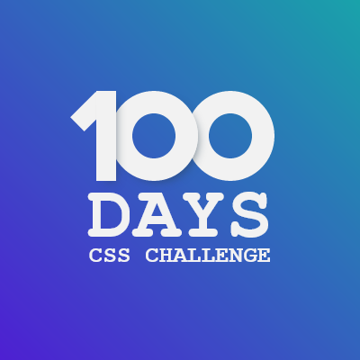

# Overview

This is my solution to [Matthias Martin "100 Days CSS"](https://codepen.io/roydigerhund) first challenge.

## Screenshot

## Solution

- Github: [click here](https://github.com/yulich81/100_days_css_challenge_day_1)
- Netlify: [click here](https://cosmic-bombolone-eadb80.netlify.app/)
- Codepen: [click here](https://codepen.io/yulich/full/jOZgdrq)

## Author

- Codepen: [my page](https://codepen.io/yulich)